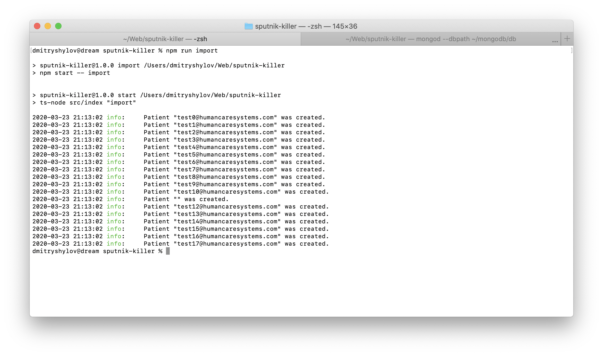
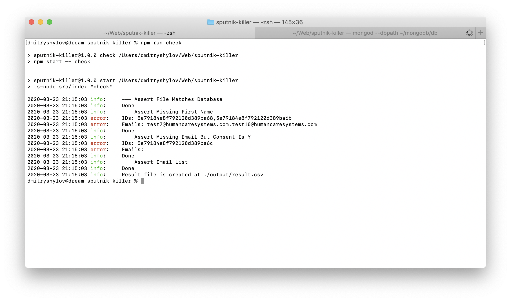

# Sputnik Killer
This application is built to become the best application in the world to manage email campaigns.

### Installation
Before you start the installation process you have to install [Node.js](https://nodejs.org/) and [MongoDB](https://www.mongodb.com/).

Then execute `npm install`.

### How to use
There are only 2 options in the application fow now: `import` and `check`.

`npm run import` performs the importing process. The application reads the csv file, parse it and insert data into database.

`npm run check` performs the validation process. The application verifies all test cases and generates csv-result file.

